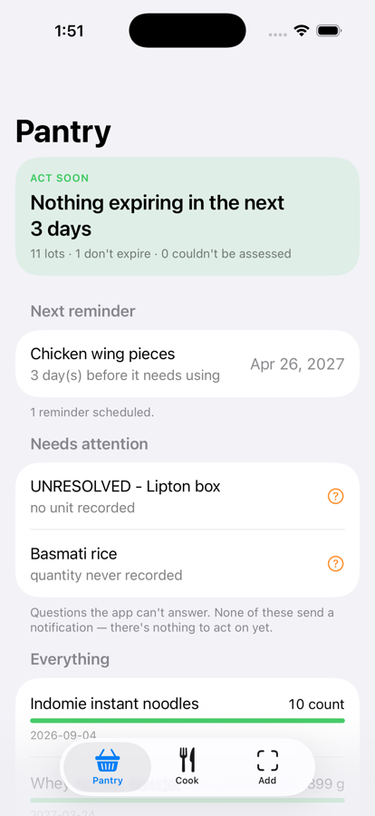
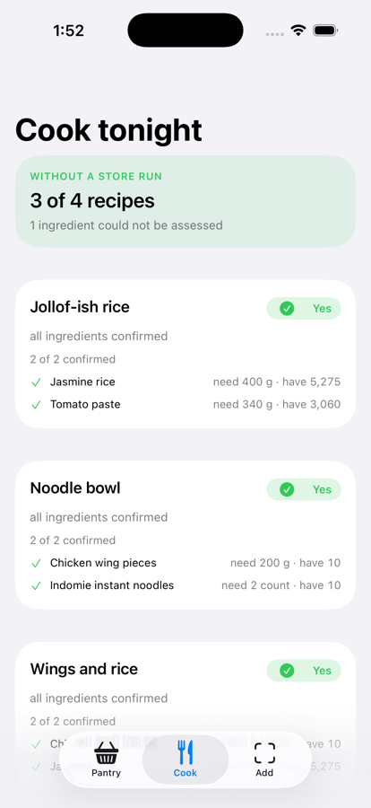
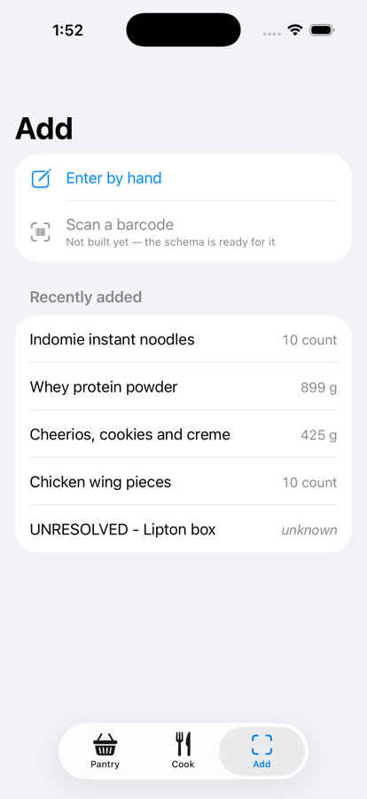

# Pantry Planner

Tracks what food is actually in my kitchen, what is about to go bad, and what I
can cook tonight without a store run.

An offline-first iOS app in Swift, over a SQLite ledger, with the logic in a
headless package the app and a CLI both share.

<p align="center">
  
  
  
</p>

## Why this exists

The interesting problem is not the CRUD. It is that the data arrives messy from
three directions at once and has to be reconciled before any feature works:

- A barcode API returns `"Gold Medal All Purpose Flour, 5 LB Bag"`.
- A recipe asks for `2 cups flour`.
- My pantry has `1.4 kg` left.

Answering "can I make this?" requires all three to become the same kind of
number first. That reconciliation is the project.

## Core modelling rules

1. **One base unit per product** — `g`, `ml`, or `count`. Chosen once, never
   mixed. Cups, tablespoons and ounces exist only at the UI boundary.
2. **Density is a property of the food, not of the units.** A cup of flour is
   ~120 g; a cup of honey is ~340 g. There is no universal conversion, so
   conversions live in their own table keyed by product.
3. **Unknown is a value, not a zero.** Missing data returns `UNKNOWN` and forces
   a handled case. Zero is a lie that arithmetic will silently propagate.
4. **Every aggregate reports its own exclusions.** A total that silently skips
   `NULL` rows returns a plausible number nobody questions — more dangerous than
   refusing to answer. Return shapes carry an `excluded` count and the UI
   surfaces it: "3 items not counted."

Those four are why the app says *"have unknown"* rather than *"have 0"*, and why
"can't tell" is a first-class answer sitting beside yes and no.

## Architecture

Untrusted data lands raw, is normalised at a single boundary, and only then
enters the canonical store. Nothing downstream reads unvalidated data.

**v1 has no server** — one SQLite database on the phone:

```
iOS client (SQLite)
    raw_capture (JSON, never edited)
          |
          v
    Normalisation
          |
          v
    Canonical tables  ->  Expiry chain
          ^               Recipe matcher
          |
   Food data API (barcode lookup, optional)
```

The logic lives in `PantryCore`, a headless Swift package. The iOS app imports
it and supplies an interface; a CLI imports it and supplies another. Neither
reimplements a rule, which is why the app's answers and `pantry cook --why`
cannot drift apart.

Phase 2 is a backend, built only once v1 is in daily use — against a schema, a
dataset and a client that already exist.

## Running it

Requires Xcode 26 or later.

```bash
# the engine, and its tests
swift test --package-path core

# rebuild the reference database from the schema and run both target queries
./schema/build.sh

# the CLI, against that database
swift run --package-path core pantry list --all
swift run --package-path core pantry cook --why
swift run --package-path core pantry inventory
```

The iOS app:

```bash
open Pantry/Pantry.xcodeproj    # then Cmd-R

xcodebuild test -project Pantry/Pantry.xcodeproj -scheme Pantry \
  -destination 'platform=iOS Simulator,name=iPhone 17 Pro'
```

On a fresh install the app is empty and offers to import the real eleven-item
inventory it was designed against — including the awkward rows.

## Status

The engine is complete and the app can both read and write: add an item, be
reminded before it expires, see what is cookable, and record eating it — all
offline, on the device.

Barcode capture is the one v1 feature still unbuilt.

## Layout

```
docs/spec.md        What v1 does, and explicitly what it does not
docs/schema.md      The logical model, and why it is shaped that way
docs/decisions/     One record per significant choice, including rejected options
docs/internal.md    Working notes: current position, what's next, build log
data/seed/          The hand-collected starting inventory
schema/             Canonical MySQL DDL, target queries, build.sh
core/               Swift package — PantryCore plus a headless CLI. The device
                    schema lives here as numbered migrations, and the starter
                    inventory beside them, because the app has to carry both.
Pantry/             The iOS app. SwiftUI over PantryCore as a local package
                    dependency — no logic of its own.
```

The nine decision records in `docs/decisions/` are the best guide to why
anything is shaped the way it is. Each one carries the options that were
rejected, so reversing a call stays cheap.
